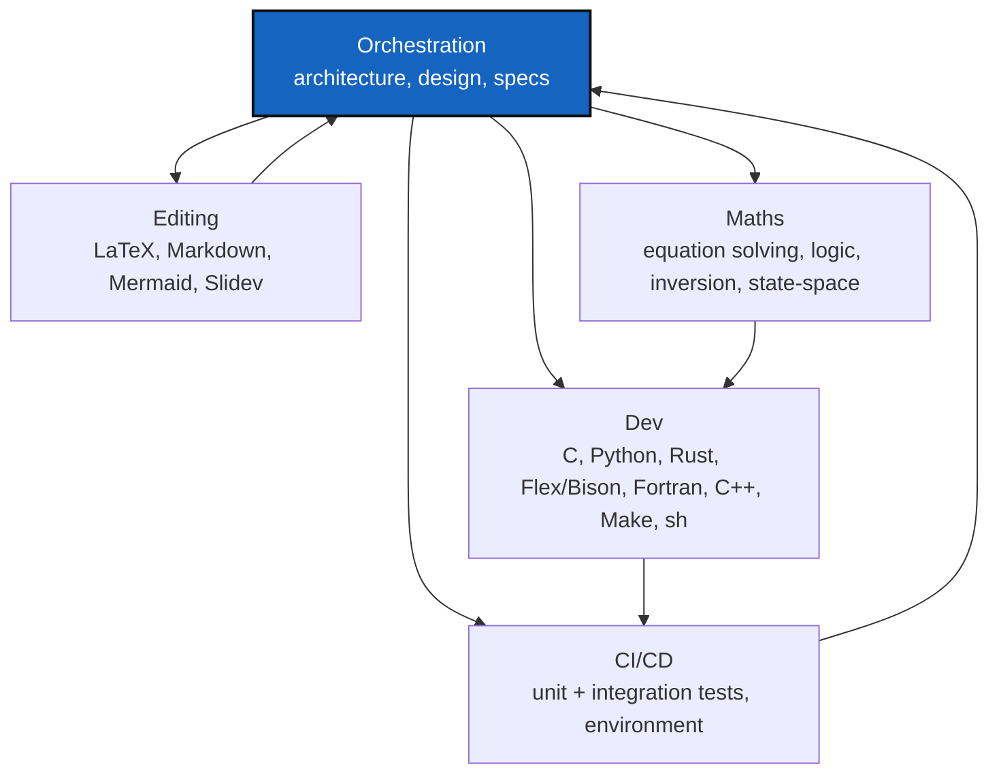

# AGENT

*Created: 2026-08-31*

## Abstract — read this first

**Template — copy before use.** Copy this file into the consuming project's
own `AgentSpecs/AGENT.md` and fill in anything project-specific (the
Orchestration row's spec filenames, any role a project genuinely doesn't
use, and the Mermaid graph if the flow differs); do not edit it in place
here and expect a project to pick up the change automatically.

**What this document is.** A reusable roster of specialized agent roles for
when several coding agents work on a project in parallel, and how an
orchestration agent hands work between them.

**Why it exists.** A single generalist agent working through a mixed task —
new code, its tests, and its write-up — serially is slower and more error
prone than splitting that task across role-scoped agents working at once.
Splitting needs an explicit boundary per role so parallel work does not
collide or duplicate effort. Rather than every project inventing its own
roster from scratch, this template fixes the roles and handoff rules once
so a project only needs to adapt the parts that are genuinely its own.

**What you will find.** A table of six agent roles, their scope, and where
each one's boundary is; handoff rules for tasks that span more than one
role.

**Who it is for.** Anyone setting up or supervising a multi-agent session
on a project that has copied this template in.

**What you need to do with it.** Route a task to the matching role before
starting it. If a task straddles two roles, decompose it through the
orchestration agent first rather than letting one agent drift into another
role's scope.

---

## Agent roles

| Agent | Scope | Out of scope — hand off to |
|---|---|---|
| **Orchestration** | Architecture, design, and specs (`DevSpecs.md`, `AdditionalSpecs.md`, `AgentSpecs/audit.md`, planning tickets); decomposes an incoming task into role-scoped sub-tasks and reconciles their output. | Writing implementation code itself — assign it to Dev instead. |
| **Dev (IT)** | Implementation and refactoring in ANSI C, Python, Rust, Flex, Bison, Fortran, C++, `make`, and shell (`.sh`). | Test-suite design and CI/pipeline wiring (→ CI/CD); prose/diagram formatting (→ Editing). |
| **CI/CD** | Unit tests, integration tests, and the working environment (build tooling, package managers, pipeline configuration). | Writing the feature code under test (→ Dev). |
| **Editing** | LaTeX, Markdown, Mermaid diagrams, Slidev decks. | Technical accuracy of the content it formats — that stays with the agent that authored it; Editing polishes structure and syntax, not substance. |
| **Maths** | Equation solving, logic derivations, matrix inversion, state-space formulations. | Turning a derivation into production code — hands it to Dev with the derivation as its spec. |
| **Scientific editing** | Bibliography management, citation formatting, academic English. | Technical content correctness — stays with the domain agent that wrote it. |

## Handoff rules

- One concern per commit still applies across agents: a `DELETE`/`MOVE`/
  `CHANGE` performed by one role is never bundled with another role's
  change in the same commit.
- A task that needs more than one role (e.g. a new numerical routine with
  its own tests and a write-up) is decomposed by the orchestration agent
  into role-scoped sub-tasks up front, not discovered mid-implementation.
- Rules specific to this project's own source — module boundaries, import
  rules, or other architecture constraints the project has adopted — live
  in `AgentSpecs/AdditionalSpecs.md` (architecture) and bind the Dev agent
  whenever it is working inside the project's own source tree.
  `AgentSpecs/audit.md` is a different file — findings, legacy references,
  and open decisions/risks, not architecture rules; don't conflate them.
