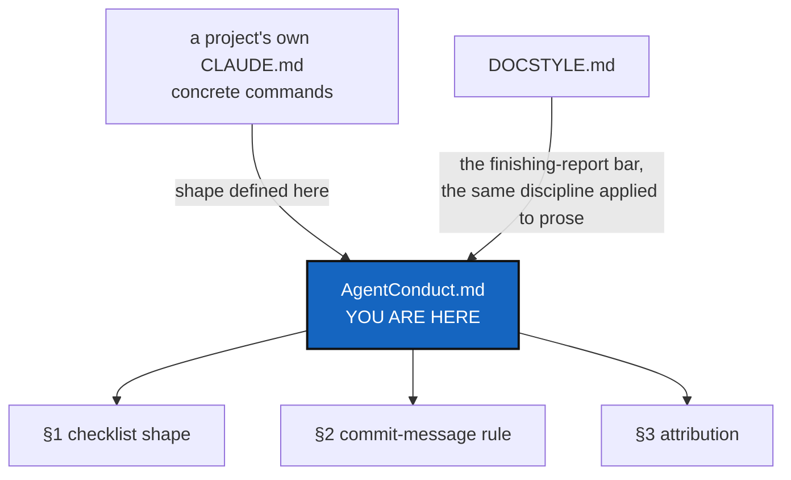

# AgentConduct — finishing a change: the checklist shape, the commit message, and credit

*Created: 2026-09-21*

## Abstract — read this first

**What this document is.** Three rules every project that declares
conformity to **DevSpecs** follows when a change is finished: the *shape*
a before-committing checklist takes, how a commit message is written, and
how AI-assisted work is credited. None of it names a command, a file, or a
module — those belong in the consuming project's own `CLAUDE.md` (or
equivalent), which fills this shape in with its own specifics.

**Why it exists.** `CLAUDE.md` in a conforming project used to restate
these three rules in full, project by project, in nearly identical words
each time. That is drift waiting to happen: a wording fixed in one
project's `CLAUDE.md` does not reach the others, and a reader cannot tell
which parts of a checklist are this project's own judgement and which are
the same rule every project follows. Stating it once here and pointing to
it is the fix.

**What you will find.** §1 the before-committing checklist, as a shape a
project fills in. §2 the commit-message rule, in full — this one has no
project-specific half. §3 attribution: crediting AI assistance without
co-signing it.

**Who it is for.** Anyone — human or agent — finishing a change in a
project that declares conformity to DevSpecs. A project's own `CLAUDE.md`
is who tells you the concrete commands; this file is why the shape looks
the way it does.

**What you need to do with it.** Read your project's own before-committing
checklist first — it is the one with the actual commands. Come here when
it points here, or when you are drafting a commit message and want the
rule in full.

---

## 1. Before committing — the shape

A project's own checklist fills in concrete commands under headings in
this order. [DevSpecs.md](DevSpecs.md)'s `Testing` section already states
the first two in prose; this restates them as checklist shape and adds the
two that follow from a project taking versioning and multi-repository
commits seriously.

1. **Lint and the full test suite pass.** Before any merge to the project's
   main branch, and before any task is considered closed — not only before
   a merge.
2. **If the project dogfoods its own tool** — manages its own working
   state through a tool it also ships, the way a build system might check
   its own configuration — that tool's own status or health command must
   report no errors, run from the tree's own root. A green test suite
   proves the code works in isolation; it does not prove the tool can
   still describe a real, tracked instance of itself. See `Testing`,
   above, for the general statement of why a green suite is necessary but
   not sufficient.
3. **A version bump, where the project's release discipline calls for
   one at this point, is a judgement call.** It is made by a reader who
   can tell "a flag was renamed" from "a flag was added" — something no
   diff states on its own — never something CI performs automatically on
   a push or merge. CI verifies a bump was made correctly; it does not
   decide that one is due, and it is never given the credentials to write
   one. A project may still choose to track a separate, mechanical build
   or change counter that *does* advance automatically with every change;
   the judgement call is specifically about what the release itself
   promises, not about every counter a project keeps.
4. **Deliver a commit message (§2) for every repository the change
   touched**, as text in the report that closes the work — the project's
   own repository and each mounted configuration repository that changed,
   each a separate Git repository with its own message. A reader who was
   away from the work should be able to read the message and know what
   landed, without opening the diff.

**Whether to commit, and whether to push, are the owner's call, made
separately, every time.** Deliver the message and stop; committing and
pushing are not implied by a finished checklist. This holds even when
nothing on the hosting platform's own branch protection would stop an
agent running under the owner's own credentials from pushing anyway — a
ruleset that exempts the account these commands run as is not a rule that
happens to also cover this case, it is *no* barrier at all, which is
exactly why the barrier has to be this one instead. Approval to push once
does not carry to the next command, the next task, or the next session.

## 2. The commit-message rule

**Starts with `<project-name><version>`. One message. Plain English.
Three lines at most.**

- **Starts with `<project-name><version>`.** The project's own name,
  immediately followed by its packaging manifest's current version, no
  space and no `v` (`widget3.1.0`, never `widget 3.1.0` or `widget
  v3.1.0`). Bump the version (§1.3) before writing the message, so the
  version it reads is current. This is what lets a reader scanning `git
  log` tell which release a change shipped in without cross-referencing
  anything else.
- **One message.** Write the *same* message for every repository the
  change touched — a project repository and the configuration repository
  that goes with it are two halves of one story, not two stories. Do not
  write a variant per repository.
- **Plain English.** Say what the change does for the person using the
  project, in words they would use. This is a deliberate tightening of
  [DOCSTYLE.md](DOCSTYLE.md) §5, which exempts commit messages generally —
  here they are not exempt. The reader is somebody scanning `git log`
  months later, not somebody holding the diff.
- **Three lines at most.** The whole message, not three paragraphs and not
  a subject line plus three. No bullet lists, no file inventories, no
  ticket numbers: the diff already says which files moved, and an archived
  planning ticket already says why.

This governs the messages a person or an agent writes by hand. It says
nothing about messages a project's own tooling generates for itself, such
as an automated formatting or housekeeping commit.

## 3. Attribution

**An agent is not credited on commits.** No co-authorship trailer and no
"generated with" line on any commit, merge, or pull request, in any
repository of a project's tree.

Work done by an LLM agent under contract is a paid service, not
authorship. Publishing and the scientific world already draw this line:
paid assistance is acknowledged, not co-signed. Co-authorship is the right
word for work given freely; it is the wrong word for work invoiced.

### Two rules, because naming an agent serves two different purposes

Credit and accountability are not the same thing, and they do not belong
in the same place. One is published; the other is nobody's business but
the people doing the work.

**The publication rule — public, and one place only.** The agent is named
in the project's own `README.md`, in a section stating which tools were
used, and in no other public place. That section is the whole of the
credit, so it carries the honesty commit trailers would otherwise have
carried. It names the tools used on the project; it does not name who did
which piece of work, because credit at that granularity is exactly the
co-signature the rule above refuses.

**The accounting rule — private, and never published.** What each agent
actually did belongs in the project's own private record of its work:
which task was served, which agent and role acted, its vendor and model
version, the states the work moved between, and how far the project's own
specs were followed. That is a record of work performed under contract,
not a by-line — the same distinction that makes paid assistance
acknowledged rather than co-signed, applied to the other half of the
question. It stays private for the reason a project's whole planning
surface is private (see [DevSpecs.md](DevSpecs.md)'s `Planning` section):
how the work is decided and
who did which part is internal, while the product is public. **A record
of what an agent did must never reach a public repository**, and nothing
in it may be copied into one.

Neither rule licenses the other. Naming an agent in the private accounting
record is not permission to name it on a commit, and the public credit is
not a summary of the accounting.

A project's own `AdditionalSpecs.md` or planning surface says where its
own accounting record lives and what fields it carries; this file states
only that the two rules are separate and neither substitutes for the
other.
