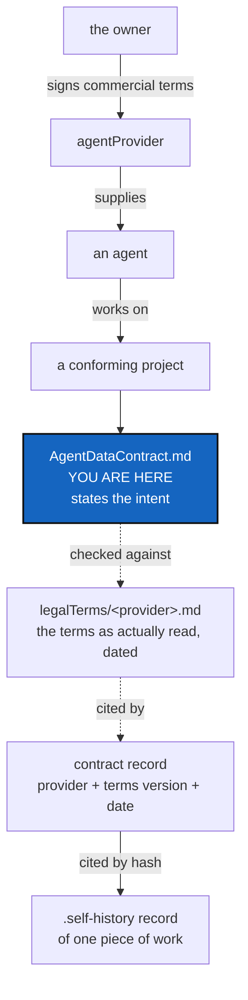

# AgentDataContract — whose data this is, and what a provider may do with it

*Created: 2026-09-23*

## Abstract — read this first

**The one-line version.** The owner intends everything an agent touches
while working on a conforming project to stay theirs, and a provider to
use it only to develop that project — but whether that intent is actually
realizable depends on terms this file does not control, and §3 is where
that gets checked rather than assumed.

**What this document is.** The data half of agentic conduct, alongside
[AgentConduct.md](AgentConduct.md)'s work half. It states the owner's
intent for who owns a project's records and what an agentProvider may do
with them, and — the part worth reading first — exactly how much a
document like this one can actually deliver on its own.

**Why it exists.** A person commissioning AI-assisted work on a private
codebase needs one place that states, plainly, what they intend for the
material to stay theirs. Without it, the question "who owns what an agent
wrote to my private repositories?" has no answer that travels with the
project — and without §3, "is that intent actually true today?" has no
answer at all.

**What you will find.** §1 the claim — stated as intent, not as an
achieved fact, and why that distinction matters. §2 what this document can
and cannot do — read this before relying on it for anything. §3 the
`legalTerms` record: the evidence a provider's terms were actually read,
for a specific access path, and whether they permit §1's intent. §4 how a
specific piece of work cites the terms that were in force when it was
done. §5 who "the owner" is, until a project needs a better answer than
one person.

**Who it is for.** Anyone — human or agent — working on a project that
mounts this file. §2 is for anyone tempted to treat this as more than it
is, which includes the agent that just wrote it. §3 is for whoever signs a
contract record: it is the thing that record must actually be checked
against, not paraphrased from memory or assumed to still hold.

**What you need to do with it.** Read §2 before citing this document as a
control, and read §3 before assuming §1's intent is actually satisfied for
a given provider and access path. This file states an intent; §3 is where
that intent meets an actual, dated reading of an actual provider's terms.

---

## 1. The claim

**This is a statement of intent, not an achieved state.** The owner's
intent: everything an agent touches on a conforming project — every record
and every piece of data linked to it, whether it sits in a private/local
repository the project writes to or a private/distant one shared read-only
across several of the owner's projects — is to be treated as the private
data of the human who commissioned the work, including a `.self-history`
record of a state mutation. The provider is to use that material to
develop the project it was supplied for, and for nothing else.

**Whether that intent is realizable is conditional, not asserted.** It
depends entirely on the terms of the agentProvider contract actually in
force for the access path in use — a subscription plan and an API key are
not the same contract and do not carry the same rights. Where the
applicable terms permit what this section intends, the intent is
fulfilled. Where they don't, nothing in this file, in a project's own
ticket, or in the contract record §4 describes changes that: a
`.self-history` record and a signed statement are a record of intent and
of the terms consulted — not a substitute for the terms actually granting
it.

**Assessing that compatibility is the owner's responsibility.** It is not
something this document, the contract record, or an agent reading either
can settle on the owner's behalf. An agent may flag an apparent mismatch
(§3's `conformityNote`), but the determination of whether a given
provider's terms actually permit this project's intent belongs to the
owner, made against the terms as they stand, not against this file's
paraphrase of them.

## 2. What this can and cannot do — read this before relying on it

**This file cannot prevent an agentProvider from using data.** No document
in a git repository constrains what happens on someone else's
infrastructure. The actual obligation comes from the commercial contract
the owner signed and from the provider's own systems and policies. A
record here is not a control, and treating it as one would be the failure
mode this section exists to head off.

Saying so plainly is not a reason to drop the claim. It is the difference
between a record that is honest about its weight and one that invites
someone to rely on it for something it cannot do — the same distinction
this project already draws elsewhere: its sync ledger is "tamper-evident,
not tamper-proof", and a conformity score says `asserted` where it is not
measured.

**What this genuinely delivers:**

| It does | It does not |
|---|---|
| State the intent explicitly, in a place that travels with the project | Enforce it |
| Give a project's `AgentContract` record somewhere to point to when it names **which terms were in force** — provider, terms reference, date | Verify the provider honoured them |
| Give that record something to be *checked against* (§3), read on a specific date, for a specific access path | Decide, on the owner's behalf, whether those terms are good enough |
| Make a later question answerable: "under what terms was this piece of work done, and did they actually permit it?" | Detect a breach |
| Put the obligation in front of every agent that reads a conforming project's specs | Bind an agent that never reads them |

That is provenance of the legal basis a piece of work was done under,
standing beside the provenance a ledger already keeps for the toolchain
that produced it. It is useful for the same reason: when terms change, the
record says which work was done under which.

**One consequence worth stating.** If the terms in force are what matters,
a terms *change* is an event a project should be able to notice. A
contract record that names a specific, dated terms reference makes that
possible; one that only says "terms were agreed" does not. §3's
`capturedDate` is the field that makes a *stale* assessment noticeable
too, which a bare terms reference does not.

## 3. The `legalTerms` record

Distinct from the contract record in §4. The contract record is the
owner's signed statement of intent (§1), hash-anchored, cited by every
`.self-history` entry that relies on it. A `legalTerms` record is the
**evidence the owner's intent was actually checked against**: the
provider's terms as they stand, for a specific access path, captured at a
point in time, plus a conformity note. Without it, there is no answer to
"did anyone actually check" — only a restated intent.

**Location.** Beside this file, in this same shared repository — a
project mounting `AgentConduct.md` mounts `legalTerms/<provider>.md` the
same way, since the terms are not per-project either. (The `AgentContract`
ticket's original design named `.agent/.distant/legalTerms/` as a sibling
of this repository's own mount point; that would need a repository of its
own to mount there, which does not exist yet, so entries live at
`legalTerms/<provider>.md` inside this repository instead, until that
changes.)

**Fields, per provider:**

| Field | Holds |
|---|---|
| `provider` | e.g. `anthropic` |
| `accessPath` | which terms apply — e.g. `consumer-subscription` vs. `commercial-api-key`. This field decides everything else: the two paths are different contracts |
| `termsDocument` | which named terms govern, with a URL |
| `termsEffectiveDate` | as published by the provider |
| `capturedDate` | when the owner, or an agent on the owner's behalf, last actually read them |
| `summary` | a few lines, in the owner's language, of what those terms say about data/training use for that access path — a paraphrase, not a substitute for the terms themselves |
| `conformityNote` | does this access path, under these terms, permit §1's intent? `permits` / `does not permit` / `partial`, with the specific clause cited |

**What this buys, and what it doesn't.** It makes "did we check" and "what
did we find" answerable and dated — the same provenance move §2 already
makes for the contract record, applied to the terms themselves rather than
to the owner's statement about them. It does not make §1's intent true; it
records whether the owner's own check found it true, and when. A
`legalTerms` entry going stale — terms change, `capturedDate` doesn't move
— is exactly the event §2's *one consequence worth stating* asks a project
to be able to notice.

See [legalTerms/anthropic.md](legalTerms/anthropic.md) for the one entry
this repository holds today: the consumer-subscription access path,
`permits partial`, with the specific carve-outs named.

## 4. Where a specific contract record lives

The owner's own words, from the ticket this file was written for:
*"recorded in the agentProvider memory"* — not the project's. That is the
right separation, and it falls out cleanly:

| Record | Scope | Why there |
|---|---|---|
| The signed contract, once per provider | **private/distant** — shared across every project this owner runs with that provider | The terms are not per-project. Signing them once per ticket would be noise, and would let two projects disagree about what was signed |
| A `legalTerms` entry (§3), once per provider and access path | **private/distant**, beside the contract record | The evidence a contract cites is shared the same way the contract itself is |
| Each `.self-history` record | **private/local** — the project doing the work | It is about that project's own work, and it *cites* the contract rather than restating it |

So a `.self-history` record carries a reference — the contract record's
hash — and the contract record carries the terms, plus a hash of the
`legalTerms` entry it was checked against. Citing the contract by hash
therefore transitively cites the `legalTerms` entry active when that
intent was signed: a `legalTerms` staleness event (§3) is a signal that
every contract record citing it may need re-review, not only a signal in
isolation.

**Tamper-evidence comes free.** A contract record named by its own content
hash, cited by hash from every `.self-history` record, cannot be quietly
edited afterwards: changing the terms changes the name, and every record
citing the old name still names the old terms. The same holds one level
down — editing a `legalTerms` entry changes *its* hash, so a contract
record's `legal_terms_sha256` stops matching, which is itself the signal
that entry moved out from under a record that cited it.

A conforming project's own planning ticket for this work — cited by name,
not by path, since a ticket is renamed when archived — is where a specific
record actually gets written: `memory/agent_contract.py` stores one
`AgentContractRecord` per hash under `agent-contracts/`, plus a plain
`current` pointer naming the one in force. `freeze_release()` reads that
pointer and, when it names a record, carries its terms version into the
release row as `artefact:agent_contract` — absent, not fatal, when nothing
has been signed yet, the same way a ledger entry written before a field
existed simply omits it rather than faking a value.

## 5. Who "the owner" is

This document assumes **one owner** — one human, the party to the
commercial contract with the agentProvider. A project used by several
people at once needs a better answer than this file gives, and that
answer belongs to whatever a project's own specs say about multi-party use
once such a project exists. Until then, "the owner" here means the one
person a conforming project's specs already treat as the one who
commissions its work.
