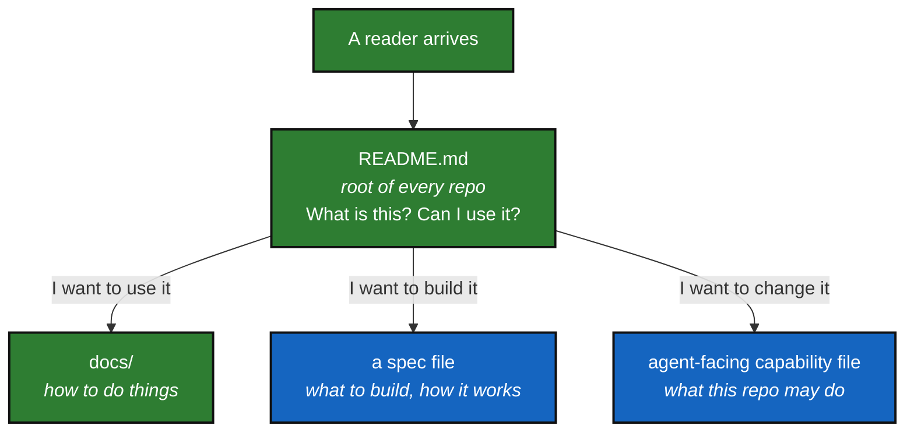

# Documentation Convention

*Created: 2026-08-28*

## Abstract — read this first

**What this document is.** The house rules for writing any document in a
project that declares conformity to **DevSpecs**.

**Why it exists.** Several people writing across several repositories will
produce as many styles unless they agree on one. The main rule is simple:
every document opens by telling a non-specialist what it is for, and shows
it as a picture.

**Who it is for.** Everyone who writes a `README.md`, a spec file, or
anything in `docs/`.

---

## 1. Every document starts with an abstract

Before any other section. Written for someone with no background in the subject.
Five short answers, no jargon:

- **What this document is** — one sentence.
- **Why it exists** — the problem it addresses.
- **What you will find** — the shape of the content.
- **Who it is for** — and what they should read first.
- **What you need to do with it** — if the reader owes an action.

Add **the one-line version** when the document has a single headline message.

## 2. Every abstract carries a mermaid graph

The graph visualises the *purpose* of the document, not its content. It answers
"where does this fit?" — usually: what comes before it, what it produces, what
comes after. Mark the current document `YOU ARE HERE`.

Keep it to eight nodes or fewer. If the graph needs a legend, it is too complex.

## 3. Audience separation

The table below describes the general pattern; a consuming project maps it
onto its own file names (see the examples, which follow the `AgentSpecs/`
layout `DevSpecs.md` establishes: `AgentSpecs/AdditionalSpecs.md`,
`AgentSpecs/AGENT.md`, `AgentSpecs/audit.md`).

| Document (general pattern) | Audience | Contains |
|---|---|---|
| root `README.md` | users | what it is, what it does, how to run it, where to go next |
| the project's spec file(s) (e.g. `DevSpecs.md`, `AgentSpecs/AdditionalSpecs.md`) | developers | features, architecture, acceptance criteria |
| `docs/` | mixed, labelled per file | procedures, references, technical notes |
| the agent-facing capability/roster file (e.g. `AgentSpecs/AGENT.md`) | agents + reviewers | capability verbs, zone, autonomy, review rule |
| the audit/decision file (e.g. `AgentSpecs/audit.md`) | decision-makers | findings, risks, decisions required |

A root `README.md` never contains build internals, API contracts, or CI
configuration. Those move to a spec file or `docs/`, and the README links to
them.

## 4. Length

If a section cannot be skimmed in under a minute, split it or cut it. Tables beat
paragraphs. A numbered finding with a severity beats three paragraphs of context.

Prefer deleting a sentence to adding a qualifier.

## 5. No stale-by-design content

Never write "Recent improvements (December 2024)" or any dated block that rots.
Recency belongs in release notes and commit history, not in prose.

## 6. One authoritative file per purpose

No `README_prod.md` beside `README.md`. No `.docx` where a `.md` will do — binary
files cannot be diffed, reviewed in a pull request, or linted.

## 7. Enforcement

A consuming project may enforce this convention with a CI check that fails
the build when a document lacks an abstract and a mermaid graph. The rule
applies to this file too.
