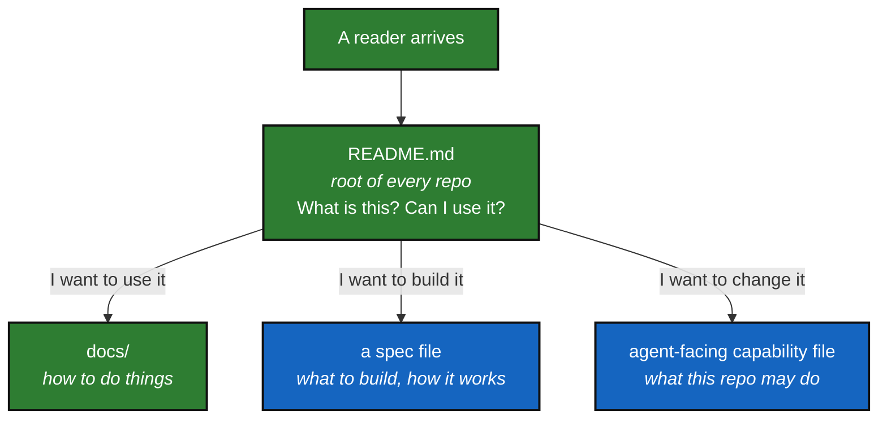

# Documentation Convention

*Created: 2026-08-28*

## Abstract — read this first

**What this document is.** The house rules for writing any document in a
project that declares conformity to **DevSpecs**.

**Why it exists.** Several people writing across several repositories will
produce as many styles unless they agree on one. The main rule is simple:
every document opens by telling a non-specialist what it is for, and shows
it as a picture.

**Who it is for.** Everyone who writes a `README.md`, a spec file, or
anything in `docs/`.

---

## 1. Every document starts with an abstract

Before any other section. Written for someone with no background in the subject.
Five short answers, no jargon:

- **What this document is** — one sentence.
- **Why it exists** — the problem it addresses.
- **What you will find** — the shape of the content.
- **Who it is for** — and what they should read first.
- **What you need to do with it** — if the reader owes an action.

Add **the one-line version** when the document has a single headline message.

## 2. Every abstract carries a mermaid graph

The graph visualises the *purpose* of the document, not its content. It answers
"where does this fit?" — usually: what comes before it, what it produces, what
comes after. Mark the current document `YOU ARE HERE`.

Keep it to eight nodes or fewer. If the graph needs a legend, it is too complex.

## 3. Audience separation

The table below describes the general pattern; a consuming project maps it
onto its own file names (see the examples, which follow the `.localSpec/`
layout `DevSpecs.md` establishes: `.localSpec/AdditionalSpecs.md`,
`.localSpec/AGENT.md`, `.localSpec/audit.md`).

| Document (general pattern) | Audience | Contains |
|---|---|---|
| root `README.md` | users | what it is, what it does, how to run it, where to go next |
| the project's spec file(s) (e.g. `DevSpecs.md`, `.localSpec/AdditionalSpecs.md`) | developers | features, architecture, acceptance criteria |
| `docs/` | mixed, labelled per file | procedures, references, technical notes |
| the agent-facing capability/roster file (e.g. `.localSpec/AGENT.md`) | agents + reviewers | capability verbs, zone, autonomy, review rule |
| the audit/decision file (e.g. `.localSpec/audit.md`) | decision-makers | findings, risks, decisions required |

A root `README.md` never contains build internals, API contracts, or CI
configuration. Those move to a spec file or `docs/`, and the README links to
them.

## 4. Length

If a section cannot be skimmed in under a minute, split it or cut it. Tables beat
paragraphs. A numbered finding with a severity beats three paragraphs of context.

Prefer deleting a sentence to adding a qualifier.

## 5. Plain English, short sentences

Write for a reader who has none of the author's context. Short sentences.
Common words. Say what a thing does before saying why, so the reader is
never stuck holding an unexplained term.

A comment or a paragraph that only makes sense to the person who wrote it
is a bug. If a sentence needs a second read to parse, split it in two. If a
term needs the reader to already know the answer, define it on first use or
cut it.

**Example.** Not this:

> initialise's own .gitignore sync writes an untracked .gitignore inside
> each parent, which import-submodules' cleanliness check then rejects —
> so the one working order deadlocked.

This:

> When you run initialise and then import-submodules, it should work. But
> import-submodules checks that the working tree is clean before
> converting. initialise had just written a .gitignore file, so the check
> saw it as uncommitted work and refused to convert.

Same facts. The second version needs no re-read, because each sentence
carries one idea.

**Expand every acronym on first use**, then it's free to use afterwards:
"the current working directory (CWD)", not "the CWD" cold. If an acronym
never gets expanded because it's used only once, spell it out instead and
skip the acronym entirely.

**Check by reading aloud.** If you stumble or have to re-read your own
sentence, a first-time reader will too — rewrite it. This applies hardest
to `tutorials/`, `README.md`, and `docs/Text/*.tex`: a reader here has no
other context to fall back on. It applies more loosely to `CLAUDE.md` and
`.localSpec/AdditionalSpecs.md`, which may assume software engineering
background but should still define a technical term on first use. It does
not apply to inline code comments, commit messages, or planning tickets
under `AgentSpec/` — those are written for someone already holding the
code or the task in front of them.

**The report you write when you finish a task follows the same rule, at
the strictest level.** This is the summary a developer or an agent writes
back at the end of a piece of work. The reader has just been away from the
task. They should not have to re-read a sentence, decode a shorthand, or
reconstruct the story from clues.

Say four things, in this order:

1. **What works now.** State it plainly. Do not hedge, and do not bury it
   under how it was built.
2. **What changed.** Name the files and commands. "`install.cgs` now names
   `.claude`" beats "the third mount entry was corrected".
3. **What is not done, or broke.** Say so directly, including anything you
   skipped and why.
4. **What the reader must decide or do next.** One list. If nothing is
   needed from them, say that too.

Name a thing before using it. Write `restart_tree`, the function behind
`cgitsync pull`, not `restart_tree` alone. Prefer one idea per sentence.
Cut a clause rather than joining it with a dash. A table is for comparing
things, not for hiding prose that was too tangled to write out.

## 6. No stale-by-design content

Never write "Recent improvements (December 2024)" or any dated block that rots.
Recency belongs in release notes and commit history, not in prose.

## 7. One authoritative file per purpose

No `README_prod.md` beside `README.md`. No `.docx` where a `.md` will do — binary
files cannot be diffed, reviewed in a pull request, or linted.

## 8. Enforcement

A consuming project may enforce this convention with a CI check that fails
the build when a document lacks an abstract and a mermaid graph. The rule
applies to this file too.
