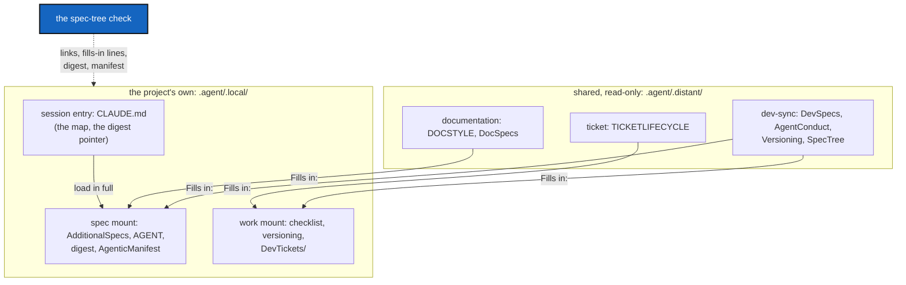

# SpecTree — the two levels, the digest, the manifest and the check that keeps them honest

*Created: 2026-10-08*

## Abstract — read this first

**The one-line version.** Every agentic topic is written twice: a general
*pattern* in the shared mounts, and a short *fill-in* in the project's own
mounts. A one-line-per-rule *digest* is loaded in full every session, a
*manifest* lists every mount and spec file, and a script fails when any of
them drift apart.

**What this document is.** The rule for how a conforming project lays out
its agentic documents: the two levels, the digest, the manifest, and the
check. It names no project and no tool-specific path beyond the mount
layout every conforming project shares.

**Why it exists.** Agentic documents grow by accretion. The same rule
ends up written in three files, a general rule sits in a project file where
no other project can reuse it, and a rule that is correctly stated but two
links away loses to a fresh instruction sitting one token from where it
needs to win. One project met all three, and a session broke a rule that
was written down. The two levels remove the copies. The digest puts the
rules in view. The check stops the drift from coming back.

**What you will find.** §1 the mount layout. §2 the two-level rule and the
`Fills in` line. §3 the digest. §4 the manifest. §5 the check. §6 what a
project's own files state.

**Who it is for.** Whoever sets up a conforming project's agentic
documents, and whoever adds a rule to them.

**What you need to do with it.** When you write a rule, ask which level it
is. If another project could use it unchanged, it goes in a shared mount.
If it names a command, a path or a choice, it goes in the project's
fill-in. Then add its line to the digest in the same change.



---

## 1. The mount layout

`.agent/` is a plain directory. It is never itself a repository. Every
repository inside it is declared directly in the project's developer spec,
each answering only to its own flags. The path says who may edit:

| Under | Is | Edited by |
|---|---|---|
| `.agent/.distant/` | shared: the same for every conforming project, on its `main` branch | nobody in the project. A change goes to the shared repository and reaches every project that mounts it |
| `.agent/.local/` | the project's own, on a branch named after the project | the project |

A shared repository holds one topic that a project can mount alone: the
development philosophy, the ticket lifecycle, the documentation
conventions. A local repository answers one question: what an agent is
handed at session start, how the product is built, how work gets done.

## 2. The two-level rule

Every agentic topic has **one pattern and at most one fill-in**.

- **The pattern** (shared) states the rule, why it exists, and the choices
  it leaves open. It names no project, no path inside a project and no
  command of a specific tool.
- **The fill-in** (local) opens with a line directly under its
  `*Created:*` line:

  ```markdown
  *Fills in: ../../.distant/dev-sync/Versioning.md*
  ```

  and states **only**: the choice the project made and why; the project's
  own names (commands, paths, files, branches); and any exception, with the
  owner's name and a date. It never restates the pattern. When the pattern
  needs a change, the change goes in the pattern.

A project with no choice to make and no exception needs no fill-in. That is
the strict necessary.

A local document that is the product's own specification (its
architecture, its audit findings) has no pattern above it. It is marked
`standalone` in the manifest instead of carrying a `Fills in` line.

## 3. The digest

`digest.md`, in the project's spec mount, holds **every MUST and NEVER of
the spec tree, one line each, with a citation** to the file and section it
comes from. Nothing else: no rationale, no abstract, no example. The
project's session entry file tells every agent to load it in full at the
start of every session.

It exists because of the failure in the abstract. The full documents stay
behind the ordinary lazy, pointer-based reading, and the digest is the floor
under forgetting one of their rules.

A digest line never replaces its source. When a line and its source
disagree, the source wins and the line is fixed in the same change that
noticed.

## 4. The manifest

`AgenticManifest.md`, in the same mount, is the one list of:

- every agentic mount (path, repository, side, role), and
- every spec file in them, with how the digest treats it (`cited`, or
  `exempt: <reason>` for a file that states no rule of its own), and, for
  a local file, whether it fills in a pattern or is `standalone`.

Whoever adds or removes a mount, or adds a spec file, changes the manifest
in the same change.

## 5. The check

A script in the project (run on its own and as part of its test suite)
checks the following. A broken link whose source lives in a shared mount is
reported and never a failure, because the project cannot fix another
repository's prose.

1. **Links.** Every Markdown link in a declared spec resolves.
2. **Reachability.** Every declared spec is reachable from the session
   entry file by some chain of links.
3. **Manifest.** The mounts in the manifest are the mounts the developer
   spec declares, no more and no fewer, and every file it lists exists.
4. **Digest.** Every citation in the digest resolves, and every declared
   spec is cited by at least one line, or exempt with a reason. The script
   cannot check that a line still says what its source says. That stays
   editorial upkeep.
5. **Fills in.** Every `*Fills in:*` line names a file that exists on the
   shared side, and every local spec in the manifest either carries one or
   is `standalone`.

A check that is not run drifts, and drift is how the copies came back the
first time. Running it is part of finishing a change.

## 6. What a project's own files state

| File | States |
|---|---|
| Session entry (`CLAUDE.md`) | what the project is, an instruction to load the digest, the reading order, and a pointer to the checklist. A map, not a manual |
| `AgenticManifest.md` | the mounts and spec files (§4) |
| `digest.md` | the rules, one line each (§3) |
| each fill-in | its choices, names and exceptions (§2) |

It does not state what a shared document already states.
