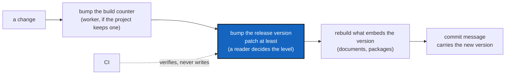

# Versioning — how a conforming project numbers what it releases

*Created: 2026-10-08*

## Abstract — read this first

**The one-line version.** A project carries a release version that says
what each release promises, and may carry a build counter that says which
build produced a record. A person decides when a release is due and how
big it is; nothing automatic ever writes the release version. Every build
is released, `patch` at least.

**What this document is.** The versioning rule every project that
declares conformity to **DevSpecs** follows: the choice of scheme, the two
numbers and when each moves, who bumps what, the order of the steps, and
what a project must say in its own fill-in. It names no command, no file
and no module. Those belong to the project.

**Why it exists.** A version is a promise to the people who use the
project, so moving it is a judgement a reader makes, and a rule that is
not written down is followed as each agent assumes it. It was written down
in one project's own spec first and was found to hold for any project,
which is why it is here.

**What you will find.** §1 the choice of scheme. §2 who decides. §3 the
two numbers. §4 who bumps what. §5 the order of the steps, and three cases
agents got wrong. §6 one command, all targets or none. §7 the release
register. §8 what the project's fill-in states.

**Who it is for.** The worker who changes the code, the orchestrator who
chooses the release level, the owner, and whoever writes a new project's
fill-in.

**What you need to do with it.** Read it once, then read the project's own
fill-in (the file whose `*Fills in:*` line names this one). It names
the commands. When a rule here and the fill-in disagree, this file is
right and the fill-in is the one to fix, unless the fill-in names an
exception with the owner's name and a date.

---

## 1. The choice of scheme

The authoritative version lives in the project's packaging manifest. Two
schemes conform:

- **Calendar** `YYYY.XX`: `XX` goes 01 → 99 in a year, then `YYYY` rises
  and `XX` goes back to `01`. Simple, and promises nothing.
- **SemVer** `MAJOR.MINOR.PATCH`, with an optional `-<stage>.<N>`
  pre-release suffix, measured against a stated public interface.

A project that publishes a package under a stability promise (a `MAJOR`
bump means a break, a `MINOR` bump only adds) wants SemVer. A project with
no such promise, or one still finding its interface, may prefer the
calendar scheme. The project's fill-in states which, and why.

With SemVer, the fill-in must also say **what the public interface is**,
because the three positions only mean something against it:

| Position | Increments when |
|---|---|
| **MAJOR** | the public interface breaks |
| **MINOR** | capability is added, compatibly |
| **PATCH** | behaviour is fixed and nothing is added |

Anything the fill-in says is *not* public (internal modules, an
experimental command) can change without a `MAJOR` bump.

## 2. A bump is a judgement, not a mechanical step

Deciding that a release is due, and what kind, needs a reader who can tell
"a flag was renamed" from "a flag was added". A diff does not say which.
So CI **verifies**: it lints, tests and rebuilds the tree, and it never
writes a version and never holds the credentials to. A project is not
conforming because it automated the bump. It conforms because a reader
made the call.

Syncing the value into other files is mechanical, and a script does it
(§6). Choosing the level is not mechanical.

## 3. Two numbers, two cadences

| Number | Moves when | Says |
|---|---|---|
| **Release version** | every time the build counter moves (at `patch` at least), and on a release that changes no code | what the project promises |
| **Build counter** (optional) | every change to the code, as part of that change | exactly which build produced a given record |

A project may keep a build counter that advances with every change,
without a reader's judgement, because it carries no promise a diff could
get wrong. The counter is provenance and never identity: it does not enter
the name or hash of anything that must stay the same across machines.

**Every build is released.** A change that moves the build counter also
moves the release version, at `patch` at least, in the same change. A
change that touches no code but changes what a script or command of the
project does is released the same way. The counter never moves without the
release version. The reason is that a fix folded into a version that was
already quoted is invisible: the version still names the work before the
fix, and every fix should be a release a reader can name.

## 4. Who bumps what

| Who | Does |
|---|---|
| **Worker**, the agent changing the code | Bumps the build counter, as part of the change. Then bumps the release version at `patch` when no orchestrator quotes the work, which is never the case when a ticket is implemented ([AgentConduct.md](AgentConduct.md) §4.1). |
| **Orchestrator**, independent, quotes the work | Decides `MAJOR`, `MINOR` or `PATCH` (never below `PATCH` when the build moved), runs the bump, tags, and writes the release row (§7). |
| **CI** | Verifies. Never writes a version. |

The build counter is bumped by the worker, not derived from the history,
and not by CI. A number derived from the history would need no credentials
either, but it would leave no act to check. An orchestrator quoting a
change can see that the bump ran, and cannot see whether a number "should"
have moved. When the point is accountable agent work, a visible act beats
an invisible automatism.

## 5. The order of the steps

1. The build counter moves (worker).
2. The release version moves, at the level the change deserves, `patch` at
   least.
3. Whatever embeds the version is rebuilt (documents, packages).
4. The commit message is written, and it carries the new version
   ([AgentConduct.md](AgentConduct.md) §2).

**The build counter is never the last versioning step.** Three cases agents
got wrong before this was written down:

- **A follow-up fix to a version not yet committed still gets its own
  patch.** A review's fixes after `3.14.0` are `3.14.1`, not "more of
  `3.14.0`".
- **No orchestrator does not mean no bump.** When the owner asks for a fix
  directly and nobody quotes it, the worker runs the `patch` bump, the
  floor. This never covers implementing a ticket: that always has an
  orchestrator, and the release bump is always the orchestrator's
  ([AgentConduct.md](AgentConduct.md) §4.1). If the change adds a
  command or a flag, it deserves `minor`. The worker says so in its
  report instead of deciding it alone.
- **"Patch" from the owner means this rule.** It means the build bump and
  then the `patch` release bump. It never means "amend the version that is
  already there".

## 6. One command, all targets or none

A project that mirrors the version into other places (a second manifest, a
package's `__version__`, a README title, a documentation macro) provides
**one** command that bumps the authoritative file and syncs the rest. No
one edits a mirrored field by hand.

The command must be atomic: it reads and rewrites every target in memory
first, and only a complete set of new texts reaches the disk. A missing
file, an unwritable one, or a field it cannot find stops the whole bump
with nothing changed. A bump that reached half its targets leaves the
project claiming a release its documentation never heard of, and does it
quietly enough that the release still looks finished.

A good command also offers a preview that writes nothing, and the
pre-release cycle (`-alpha.1`, `-beta.2`, `-rc.1`, then the release),
which sorts correctly under SemVer and is understood by every tool.

The bump script is orchestrator tooling and lives in the project's private
mount, not in the public repository, so a public-only checkout cannot cut
a release. It is not shared either, because every path it touches belongs
to the project.

## 7. The release register

A project that keeps a ledger of what it did records a release as one
entry in it, so that the release cannot be edited afterwards without
breaking the ledger from that point on. Whether it has such a register,
and what the row carries, is the project's choice, stated in its fill-in.

## 8. What the project's fill-in states

The fill-in opens with a `*Fills in:*` line naming this file ([SpecTree.md](SpecTree.md) §2) and says only:

1. The scheme, and why (§1), and for SemVer the public interface.
2. Whether there is a build counter, and where each number lives.
3. The command names for the build bump and the release bump, and the
   files the release bump writes.
4. What must be rebuilt after a bump, and the command.
5. The release register, if any.
6. Any exception, with the owner's name and a date.

It does not restate §2 to §6.
