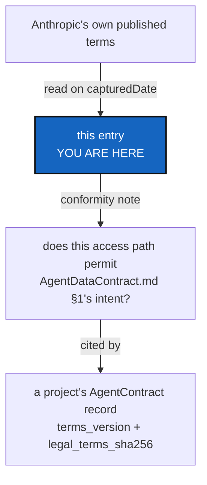

# legalTerms — anthropic

*Created: 2026-09-23*

## Abstract — read this first

**What this document is.** The evidence behind one entry of
[AgentDataContract.md](../AgentDataContract.md) §3: the terms Anthropic
actually publishes for the access path this owner uses today, read at a
specific date, with a conformity note stating whether they permit
[AgentDataContract.md](../AgentDataContract.md) §1's intent — and where
they don't, exactly.

**Why it exists.** [AgentDataContract.md](../AgentDataContract.md) §1
states an intent; it does not, and cannot, tell anyone whether that intent
is realizable under a specific provider's actual terms. Answering that
needs someone to have actually read those terms, on a specific date, for a
specific access path — a subscription and an API key are different
contracts and do not carry the same rights — and to say so plainly rather
than asserting compliance as settled fact.

**What you will find.** Which access path this entry covers, the terms
document and its effective date, when it was last read, a plain-language
summary, and a conformity note that is a *dated assessment*, not a
guarantee.

**Who it is for.** Anyone signing a
[content-addressed AgentContract record](../AgentDataContract.md#4-where-a-specific-contract-record-lives)
that cites `anthropic` as its provider — the record's `terms_version`
should name this entry's `termsDocument` and `termsEffectiveDate`, and its
`legal_terms_sha256` should be this file's own content hash. Also for
whoever next asks "does this still hold" — that question is answered by
comparing `capturedDate` against Anthropic's current terms, not by reading
this file's `conformityNote` as if it does not age.

**What you need to do with it.** Re-capture this entry when the access
path changes (subscription vs. API key) or when Anthropic's terms document
changes its effective date — whichever comes first, and treat a stale
`capturedDate` as itself the signal, not a defect this document tries to
hide.



---

## The entry

```yaml
provider: anthropic
accessPath: consumer-subscription
termsDocument: "Consumer Terms of Service"
termsUrl: https://www.anthropic.com/legal/consumer-terms
termsEffectiveDate: 2025-10-08
capturedDate: 2026-09-23
summary: >
  Section 4 ("Inputs, Outputs, Actions, and Materials"): Anthropic may use
  Materials (Inputs and Outputs) to provide, maintain and improve the
  Services and to develop other products and services, including training
  its models, unless the user opts out through account settings. Two
  carve-outs apply regardless of that opt-out: Materials are still used
  for training when the user gives Feedback on them, and when Materials
  are flagged for safety review to detect harmful content, enforce policy,
  or advance safety research. Separately, Section 3 ("Use of our
  Services") restricts automated, scripted or bot access to the Services
  under this access path except via an Anthropic API key or where
  Anthropic otherwise explicitly permits it.
conformityNote: >
  partial — this access path permits AgentDataContract.md §1's intent
  ONLY if training opt-out is enabled in account settings, AND only
  outside the two carve-outs (Feedback given on a Material; a Material
  flagged for safety review), neither of which any account setting can
  waive. This entry does not by itself authorize scripted/automated
  access under Section 3; confirm the actual invocation path (interactive
  session vs. an automation calling the same account) separately before
  citing this entry for that question.
verifiedAgainstLiveDocument: true
```

**How this was captured.** Read directly from
`https://www.anthropic.com/legal/consumer-terms` on `capturedDate`, not
transcribed from a prior summary — `verifiedAgainstLiveDocument: true`
records that distinction, since a `legalTerms` entry is only as good as
the read behind it. Section numbers are as published on that date and may
be renumbered by Anthropic without changing the substance; a future
re-capture should re-quote them rather than assume they still match.

**What this does not do.** It does not decide whether the conformity note
is *good enough* for the owner's purposes — that determination belongs to
the owner, per [AgentDataContract.md](../AgentDataContract.md) §1, and
depends on facts this entry cannot see: whether training opt-out is
actually enabled on this account, and whether the automation invoking an
agent under this access path counts as the kind of access Section 3
restricts. Both are worth the owner confirming directly rather than
inferring from this entry.
